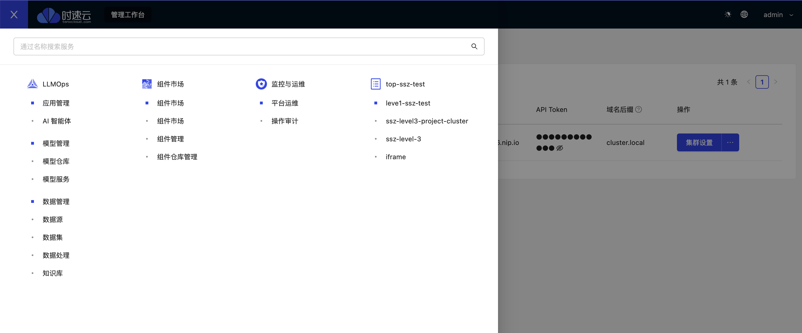

# 安装文档

## 机器配置

### 单机配置

| 类型 | 配置 |
| --- | --- |
| CPU | 16核 |
| Memory | 96G |
| GPU | 推荐GPU4090 |
| CUDA运行时 | 12.2 |
| OS | Ubuntu22.04 |

## 预先准备

### 0. 基础

- Docker
- Helm
- kubectl

### 1. 准备一个Kubernetes集群

集群安装方式有以下几种:

- [kind](https://kind.sigs.k8s.io/docs/)
- [minikube](https://minikube.sigs.k8s.io/)
- [kubeadm](https://kubernetes.io/docs/admin/kubeadm/)

下面以kind为例，介绍如何安装一个可用于kubeagi的单节点k8s集群:

1. 克隆arcadia代码

```bash
git clone https://github.com/kubeagi/arcadia.git
```

1. 配置Docker使用nvidia runtime

编辑 `/etc/docker/daemon.json`

```json
{
    "default-runtime": "nvidia",
    "runtimes": {
        "nvidia": {
            "args": [],
            "path": "nvidia-container-runtime"
        }
    }
}
```

重启docker:

```bash

sudo systemctl restart docker

```

1. 配置nvidia容器运行时

编辑 `/etc/nvidia-container-runtime/config.toml` ，设置

`accept-nvidia-visible-devices-as-volume-mounts = true`

1. 创建单节点kind集群

```bash
cd arcadia
make kind
```

安装完成后，运行如下命令:

```bash
docker exec -ti kubeagi-control-plane ln -s /sbin/ldconfig /sbin/ldconfig.real
```

## 2. 安装nvidia gpu operator

```bash
helm repo add nvidia https://helm.ngc.nvidia.com/nvidia
helm repo update
helm install --generate-name \
     -n gpu-operator --create-namespace --version v23.9.1 \
     nvidia/gpu-operator --set driver.enabled=false
```

## 3. 安装kubebb

参考: [https://kubebb.github.io/website/docs/quick-start/quick-install](https://kubebb.github.io/website/docs/quick-start/quick-install)

1. 克隆components仓库

```bash
git clone https://github.com/kubebb/components.git
```

1. 安装内核

```bash
cd charts/kubebb-core
helm install -nkubebb-system --create-namespace kubebb-core .
```

查看安装状态:

```bash
kubectl get pods -nkubebb-system
```

1. 安装集群组件

进入集群组件工作目录:

```bash
cd charts/cluster-component
```

编辑values.yaml

- 替换 `<replaced-ingress-node-name>` 为集群节点名(此处为 `kubeagi-control-plane` )

执行helm安装:

```bash
helm install -nu4a-system --create-namespace cluster-component .
```

查看状态

```bash
kubectl get pods -nu4a-system 
```

安装成功后可获取ingress node ip:

```bash
kubectl get node kubeagi-control-plane -owide
```

1. 安装u4a组件

进入u4a组件工作目录

```bash
cd charts/u4a-component
```

编辑values.yaml

- 替换 `<replaced-ingress-nginx-ip>` 为上述获取的ingress node ip

执行helm安装:

```bash
helm install -nu4a-system u4a-component .
```

查看状态:

```bash
kubectl get pods -nu4a-system 
```

## 正式安装

1. 克隆arcadia代码

```bash
git clone https://github.com/kubeagi/arcadia.git
```

1. 进入工作目录

```bash
cd arcadia/deploy/charts/arcadia
```

1. 编辑 values.yaml

- 替换 `<replaced-ingress-nginx-ip>` 为kubebb安装过程中部署的ingress node IP

1. 安装

```bash
helm install arcadia -n kubeagi-system --create-namespace  .
```

1. 查看安装状态

```bash
kubectl get pods -n kubeagi-system
```

1. 访问arcadia门户

`https://portal.<replaced-ingress-nginx-ip>.nip.io`



默认的用户名密码为： `admin kubebb-admin`

## 升级到v0.x.x

1. 下载v0.x.x对应的helm charts (helm包地址: <https://github.com/kubeagi/arcadia/releases/tag/arcadia-0.x.x>)
2. 编辑values.yaml并编辑

- 替换 `<replaced-ingress-nginx-ip>` 为kubebb安装过程中部署的ingress node IP

1. 升级

工作目录：helm包内部

```bash
helm upgrade -nkubeagi-system arcadia . -f values.yaml
```

1. 升级crd(可选)

```bash
kubectl apply -f crds/
```
